# Karvan 🚐

Karavancılar için **kamp alanı keşfi + topluluk platformu**. Türkçe, mobil öncelikli bir **PWA**'dır:
telefon tarayıcısında açılır, ana ekrana eklenebilir, çevrimdışı çalışır ve Capacitor ile
Android/iOS paketine dönüştürülebilir.

İki katmandan oluşur:

1. **Keşif**: 29 örnek tesis, harita, filtreler, favoriler, gezi planlama ve maliyet hesapları.
2. **Topluluk**: karavancıların paylaşım yaptığı, birbirini takip ettiği, yorumlaştığı ve
   buluşmalara katıldığı sosyal katman — animasyonlu, canlı etkileşimli.

## Ekranlar

| Keşfet | Ara | Harita |
| --- | --- | --- |
| 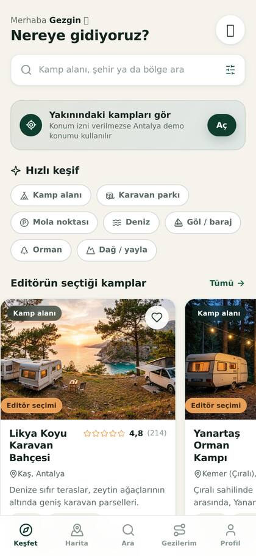 | 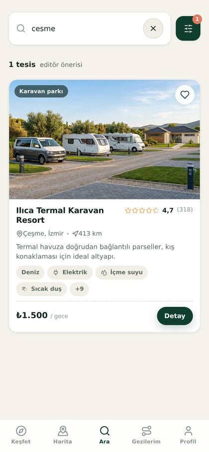 | 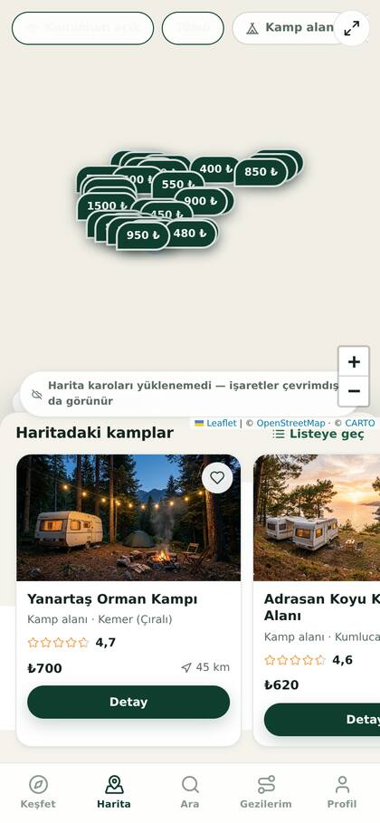 |

| Kamp detayı | Gezi planlama | Rota özeti |
| --- | --- | --- |
| 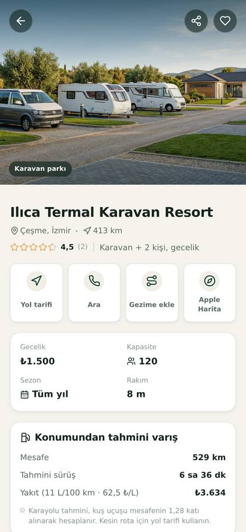 | 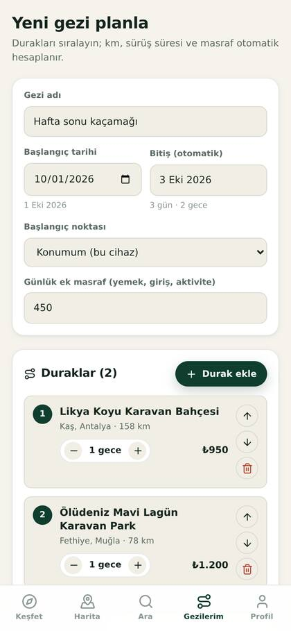 | 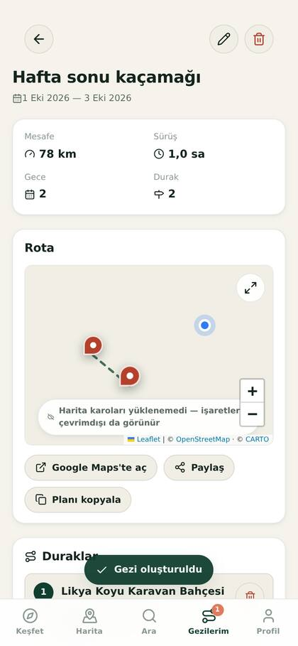 |

| Topluluk akışı | Yorumlar | Paylaşım oluşturma |
| --- | --- | --- |
| 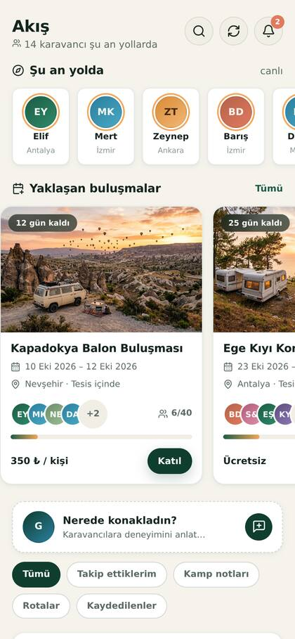 | 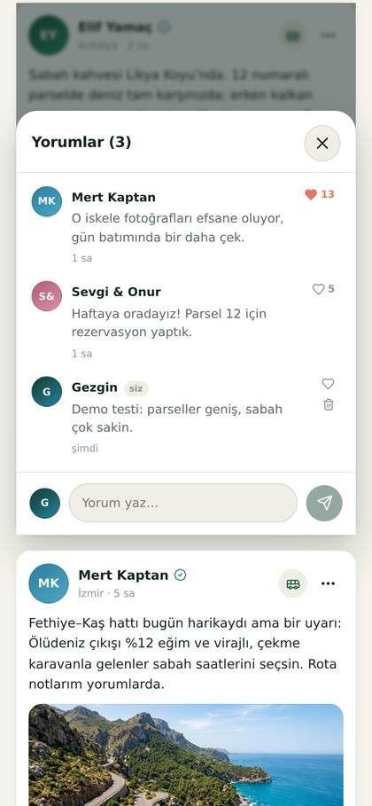 | 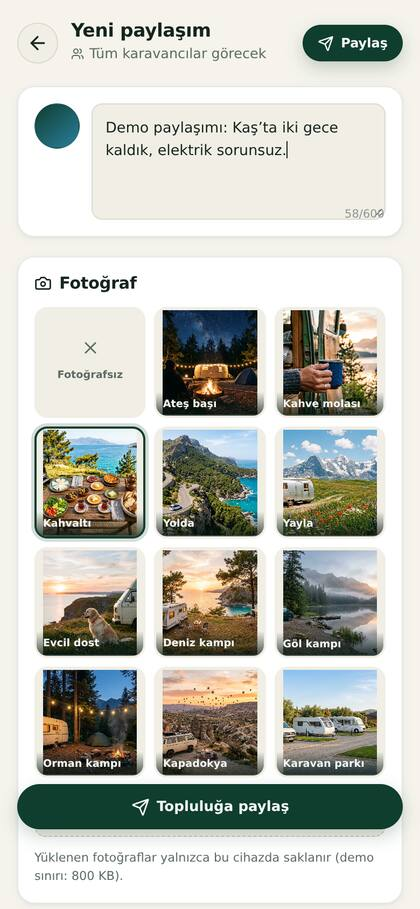 |

| Buluşma | Karavancı profili | Bildirimler |
| --- | --- | --- |
| 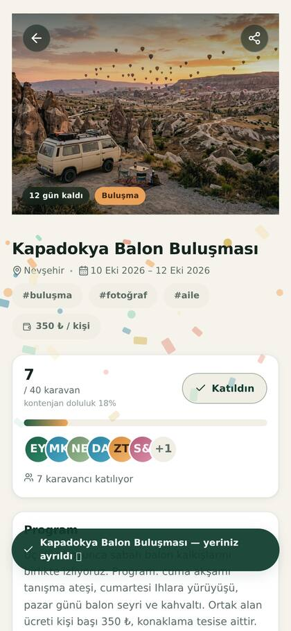 | 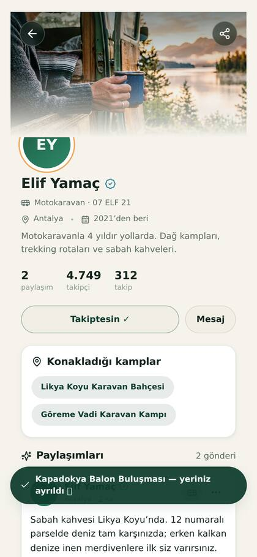 | 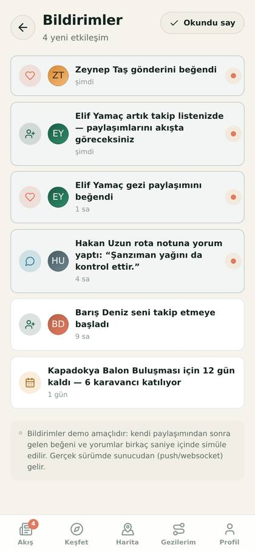 |

## Neler var?

| Ekran | İçerik |
| --- | --- |
| **Akış** | Topluluk akışı: paylaşımlar, beğeni, yorum, kaydetme, takip, konuya ve tesise göre filtre, aşağı çekip yenileme, sonsuz kaydırma; yaklaşan buluşmalar ve "şu an yolda" şeridi |
| **Paylaşım** | Metin + fotoğraf (hazır galeri ya da kendi yüklemeniz), tesis etiketi, konu etiketi, gezi özeti kartı, canlı önizleme, konfeti animasyonu |
| **Buluşmalar** | Karavancı konvoyları ve festivaller: kontenjan çubuğu, katılımcı listesi, katıl/ayrıl, harita, düzenleyeni takip etme |
| **Karavancı profili** | Kapak fotoğrafı, araç/plaka/şehir bilgisi, paylaşım-takipçi-takip istatistikleri (sayaç animasyonu), konakladığı kamplar, takip et, paylaş |
| **Bildirimler** | Beğeni, yorum, takip ve buluşma bildirimleri; okunmamış noktası ve "okundu say" |
| **Keşfet** | Selamlama, konum bandı, hızlı filtre çipleri, editör seçimi ve yakındaki kamplar, topluluktan taze notlar, bölgeye göre keşif, son baktıklarınız |
| **Harita** | Tüm tesisler fiyat baloncuklu işaretlerle, tesis tipi filtreleri, kart şeridi, tam ekran harita |
| **Ara** | Metin arama (Türkçe karakter duyarsız), 15 olanak + tesis tipi + manzara filtreleri, bütçe ve puan eşiği, 5 sıralama seçeneği |
| **Kamp detayı** | Fotoğraf, puan dağılımı, tesis olanakları, konum haritası, yol tarifi (Google/Apple Maps), telefonla arama, yakın çevredeki kamplar, yorum yazma |
| **Gezilerim** | Çok duraklı gezi planlama: gece sayısı, toplam km, sürüş süresi, yakıt + konaklama + ek masraf dökümü, rota haritası, planı kopyala/paylaş |
| **Profil** | Araç tipi, tüketim (L/100 km) ve yakıt fiyatı, hızlı yol maliyeti hesaplayıcı, açık/koyu tema, konum, veri yönetimi |

### Topluluk: karavancılar birbiriyle nasıl etkileşiyor?

- **Paylaşım**: metin + fotoğraf (galeriden seç ya da kendi dosyanı yükle), bulunduğun tesisi etiketle,
  konu etiketi seç (`#rota`, `#bakım`, `#köpekli`…). Gezilerim ekranından tek dokunuşla rota özetli
  paylaşım üretilebilir.
- **Etkileşim**: beğeni (çift dokunmayla kalp patlaması), yorum yazma/beğenme/silme, kaydetme,
  paylaşma, karavancı takip etme.
- **Akış**: "Takip ettiklerim / Kamp notları / Rotalar / Kaydedilenler" filtreleri, gerçek
  aşağı-çekip-yenile jesti (yeni paylaşım düşer), sonsuz kaydırma ve iskelet yükleme animasyonları.
- **Buluşmalar**: Kapadokya balon buluşması, Ege kıyı konvoyu gibi etkinliklere katılma; kontenjan
  çubuğu ve katılımcı avatarları canlı güncellenir.
- **Bildirimler**: beğeni/yorum/takip/buluşma bildirimleri; okunmamış rozeti sekme çubuğunda.
- **Canlı etkileşim (demo)**: paylaşım yaptıktan sonra birkaç saniye içinde gelen beğeni, yorum ve
  takipçiler simüle edilir ve bildirimlere düşer. Gerçek sürümde bu katman bir API/websocket'e bağlanır;
  arayüz aynı kalır.

### Animasyonlar

- Ekran geçişleri (`rise`), gönderi kartlarında kademeli giriş, iskelet parıltısı, kalp patlaması +
  parçacıklar, konfeti (paylaşım ve buluşma katılımında), dolum çubuğu, harita işaretlerinin sırayla
  düşmesi, kesikli rota çizgisi animasyonu, sekme çubuğunda kayan aktif gösterge, sayaç animasyonu,
  toast ve panel geçişleri.
- `prefers-reduced-motion` tercihine saygı gösterir: hareket azaltma açıksa animasyonlar kapanır.

### Öne çıkan detaylar

- **Mesafe & maliyet mantığı**: kuş uçuşu mesafe × 1,28 katsayısıyla karayolu tahmini, ortalama 80 km/sa
  sürüş süresi, `mesafe / 100 × tüketim × litre fiyatı` yakıt hesabı.
- **Türkçe arama normalizasyonu**: `ı/İ/ç/ş/ğ/ü/ö` harfleri sadeleştirilir, "cesme" yazınca "Çeşme" bulunur.
- **Çevrimdışı**: service worker uygulama kabuğunu ve harita karolarını (son 240 karo) önbelleğe alır.
- **Yerel veri**: favoriler, geziler, profil ve yorumlar `localStorage`'da tutulur; hesap gerekmez.
- **Erişilebilirlik**: `aria-label`, `aria-pressed`, odak görünürlüğü ve azaltılmış hareket desteği.

## Çalıştırma

```bash
npm install
npm run dev        # http://localhost:5173
npm run build      # dist/ üretir
npm run preview    # derlenmiş sürümü sunar
npm run typecheck  # sadece tip kontrolü
```

## Telefonda deneme

1. Aynı wifi'deki bilgisayarda `npm run dev -- --host` çalıştırın.
2. Terminaldeki `Network` adresini telefonunuzda açın.
3. Tarayıcı menüsünden **Ana ekrana ekle** seçin — uygulama tam ekran açılır.

## Android / iOS paketi (Capacitor)

```bash
npm run build
npx cap add android     # ilk kez (native proje üretir)
npx cap add ios         # macOS + Xcode gerekir
npm run cap:sync        # dist'i native projelere kopyalar
npm run cap:android     # Android Studio ile açar
```

`android/` ve `ios/` klasörleri git'e eklenmez (`.gitignore` içindedir); ihtiyaç hâlinde
yukarıdaki komutlarla yeniden üretilir.

## Proje yapısı

```
src/
  components/   PostCard, CommentsSheet, EventCard, Avatar, AvatarStack, Confetti, Skeleton,
                CampCard, MapView, FilterSheet, Layout (sekme çubuğu), Toast
  data/         camps.ts + community.ts (örnek tesis ve topluluk verisi), taxonomy.ts, places.ts
  hooks/        animations.ts — sayı sayacı, reveal, aşağı çekip yenileme, sonsuz kaydırma
  lib/          geo (mesafe/rota), trip (bütçe özeti), search (filtre+sıralama), time (göreli zaman),
                plate (plaka→şehir), format, storage, demo
  screens/      Feed, Composer, UserProfile, Notifications, Events, EventDetail,
                Discover, Map, Search, CampDetail, Trips, TripEditor, TripDetail, Profile
  store/        AppStore.tsx  — favoriler, geziler, profil, tema, konum
                SocialStore.tsx — paylaşımlar, beğeni/yorum, takip, buluşmalar, bildirimler
  types.ts      Ortak veri tipleri
```

## Örnek veri uyarısı

`src/data/camps.ts` içindeki **29 tesis kaydı** ve `src/data/community.ts` içindeki **karavancılar,
paylaşımlar, yorumlar ve buluşmalar** tamamen örnektir: isimler, plakalar, telefonlar, fiyatlar ve
yorumlar temsilîdir; gerçek kişi ya da işletmeleri göstermez. Uygulama gerçek bir API'ye
bağlanacaksa tek yapılması gereken bu modülleri `fetch` çağrılarıyla değiştirmektir; tip tanımları
(`Camp`, `CommunityPost`, `CommunityUser`, `CommunityEvent`) aynı kalır.

Kullanıcı verisi (favoriler, geziler, kendi paylaşımları, beğenileri, takip listesi, katıldığı
buluşmalar) `localStorage`'da tutulur; hesap ya da sunucu gerekmez.

## Yol haritası

- [x] Topluluk akışı: karavancı paylaşımları, beğeni, yorum, takip
- [x] Buluşma / etkinlik takvimi (konvoy ve festival buluşmaları)
- [ ] Gerçek zamanlı katman: paylaşım/yorum/bildirimler için API + websocket (şu an demo simülasyonu)
- [ ] Doğrudan mesajlaşma ve karavancı grupları
- [ ] Bakım ve masraf günlüğü (garaj modülü)
- [ ] Çevrimdışı harita karolarının bölge bazlı indirilmesi
- [ ] Fotoğraf yükleme için bulut depolama (şu an cihaz içi, 800 KB sınırı)

## Lisans

MIT
